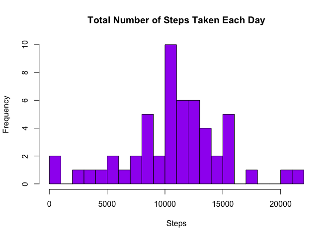
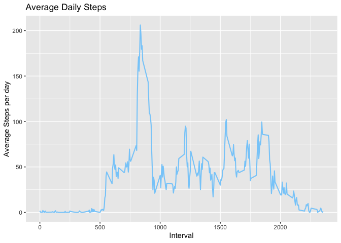
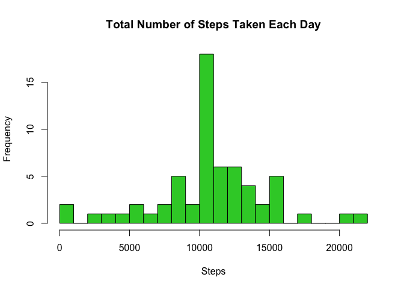
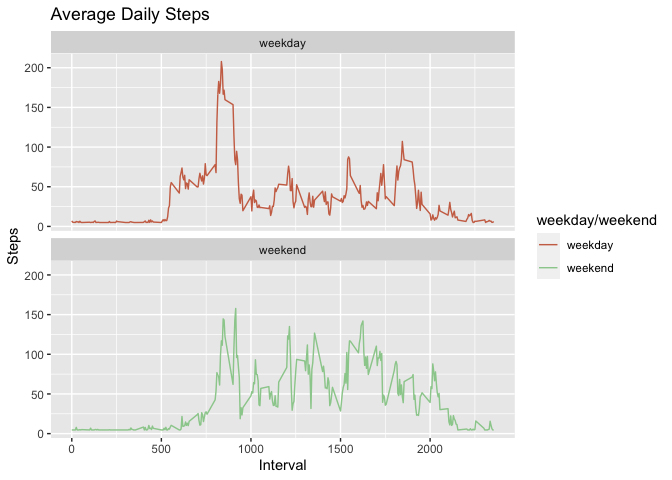

## **Objectives**
1) Load and preprocess the data.
2) Determine the mean number of steps taken per day.
3) Identify the average daily activity pattern.
4) Impute missing values.
5) Compare activity patterns between weekdays and weekends.

#### **Objective 1**: *Load and preprocess the data.*
##### Load the necessary packages

```r
library("data.table")
library(ggplot2)
```
##### Unzip the file in the current working directory

```r
fileUrl <- "https://d396qusza40orc.cloudfront.net/repdata%2Fdata%2Factivity.zip"
download.file(fileUrl, destfile = paste0(getwd(), '/repdata%2Fdata%2Factivity.zip'), method = "curl")
unzip("repdata%2Fdata%2Factivity.zip",exdir = "Activity_Monitoring_Data")
```
##### Load the data into the environment as a data table

```r
DT <- data.table::fread(input = "Activity_Monitoring_Data/activity.csv")
```


#### **Objective 2**: *Determine the mean number of steps taken per day.*
##### Calculate the total number of steps taken per day

```r
total_steps <- DT [, c(lapply(.SD, sum, na.rm=FALSE)), .SDcols = c("steps"), by = .(date)]

head(total_steps, 10)
```

```
##           date steps
##  1: 2012-10-01    NA
##  2: 2012-10-02   126
##  3: 2012-10-03 11352
##  4: 2012-10-04 12116
##  5: 2012-10-05 13294
##  6: 2012-10-06 15420
##  7: 2012-10-07 11015
##  8: 2012-10-08    NA
##  9: 2012-10-09 12811
## 10: 2012-10-10  9900
```
##### Make a histogram of the total number of steps taken each day

```r
hist(total_steps$steps, breaks = 20, main = "Total Number of Steps Taken Each Day", xlab = "Steps", col = "purple")
```

<!-- -->

##### Calculate the mean and median of the total number of steps taken per day

```r
total_steps[, .(mean = round(mean(steps, na.rm = TRUE)), median = median(steps, na.rm = TRUE))]
```

```
##     mean median
## 1: 10766  10765
```
#### **Objective 3**: *Identify the average daily activity pattern.*
##### Make a time series plot of the 5-minute interval and the average number of steps taken, averaged acrosss all days

```r
intDT <- DT[, c(lapply(.SD, mean, na.rm = TRUE)), .SDcols = c("steps"), by = .(interval)] 
ggplot(intDT, aes(x = interval , y = steps)) + geom_line(color="lightskyblue", size=0.75) + labs(title = "Average Daily Steps", x = "Interval", y = "Average Steps per day")
```

<!-- -->
##### Find which 5-minute interval, on average across all the dats in the dataset, contains the maximum number of steps

```r
intDT[steps == max(steps), .(maximum_interval = interval)]
```

```
##    maximum_interval
## 1:              835
```
#### **Objective 4**: *Impute missing values.*
##### Calculate and report the total number of missing values in the dataset

```r
DT[is.na(steps), .N ]
```

```
## [1] 2304
```
##### Devise a stategy for filling in all of the missing values in the dataset

```r
DT[is.na(steps), "steps"] <- DT[, c(lapply(.SD, mean, na.rm = TRUE)), .SDcols = c("steps")]
```

```
## Warning in `[<-.data.table`(`*tmp*`, is.na(steps), "steps", value =
## structure(list(: 37.382600 (type 'double') at RHS position 1 truncated
## (precision lost) when assigning to type 'integer' (column 1 named 'steps')
```
##### Create a new dataset that is equal to the original dataset but with the missing data filled in

```r
data.table::fwrite(x = DT, file = "Activity_Monitoring_Data/full_data.csv", quote = FALSE)
```
##### Make a histogram of the total number of steps taken each day

```r
total_steps_full <- DT [, c(lapply(.SD, sum, na.rm=FALSE)), .SDcols = c("steps"), by = .(date)]
hist(total_steps_full$steps, breaks = 20, main = "Total Number of Steps Taken Each Day", xlab = "Steps", col = "limegreen")
```

<!-- -->
##### Calculate and report the mean and median total number of steps taken per day

```r
total_steps_full[, .(mean = round(mean(steps, na.rm = TRUE)), median = median(steps, na.rm = TRUE))]
```

```
##     mean median
## 1: 10752  10656
```
##### Do these values differ from the estimates from the first part of the assignment? 
Yes, these values differ from the previously calculated mean and median.

##### What is the impact of imputing missing data on the estimates of the total daily number of steps?

```r
total_steps_full <- DT [, c(lapply(.SD, sum, na.rm=FALSE)), .SDcols = c("steps"), by = .(date)]
head(total_steps_full, 10)
```

```
##           date steps
##  1: 2012-10-01 10656
##  2: 2012-10-02   126
##  3: 2012-10-03 11352
##  4: 2012-10-04 12116
##  5: 2012-10-05 13294
##  6: 2012-10-06 15420
##  7: 2012-10-07 11015
##  8: 2012-10-08 10656
##  9: 2012-10-09 12811
## 10: 2012-10-10  9900
```
#### **Objective 5**: *Compare activity patterns between weekdays and weekends.*
##### Create a new factor variable in the dataset with two levels – “weekday” and “weekend” indicating whether a given date is a weekday or weekend day.

```r
DT[, date := as.POSIXct(date, format = "%Y-%m-%d")]
DT[, `Day`:= weekdays(x = date)]
DT[grepl(pattern = "Monday|Tuesday|Wednesday|Thursday|Friday", x = `Day`), "weekday/weekend"] <- "weekday"
DT[grepl(pattern = "Saturday|Sunday", x = `Day`), "weekday/weekend"] <- "weekend"
DT[, `weekday/weekend` := as.factor(`weekday/weekend`)]
```
##### Make a panel plot containing a time series plot of the 5-minute interval (x-axis) and the average number of steps taken, averaged across all weekday days or weekend days

```r
intDT <- DT[, c(lapply(.SD, mean, na.rm = TRUE)), .SDcols = c("steps"), by = .(interval, `weekday/weekend`)]
ggplot(intDT , aes(x = interval , y = steps, color=`weekday/weekend`)) + labs(title = "Average Daily Steps", x = "Interval", y = "Steps") + facet_wrap(~`weekday/weekend` , ncol = 1, nrow=2) + geom_line() + scale_color_manual(values = c("salmon3", "darkseagreen3"))
```

<!-- -->


